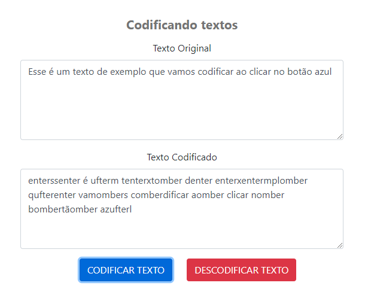
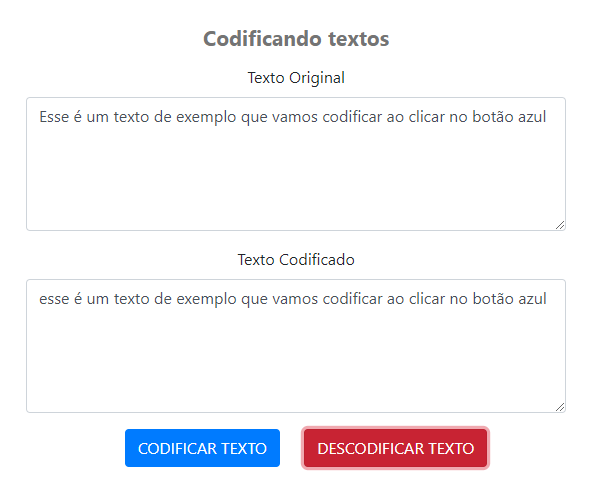

"Este projeto está licenciado sob os termos da licença MIT."

## Texto codificado
Quando clicar no botão CODIFICAR TEXTO o texto original fica "embaralhado" no campo Texto codificado

    

## Texto original
Quando clicar no botão DESCODIFICAR TEXTO o texto "embaralhado" no campo Texto codificado volta ao texto original

    

